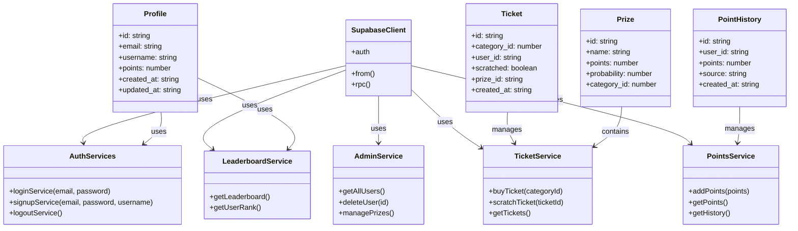

# Documentation Architecture

## Vue d'Ensemble du Système

Ce document fournit une vue d'ensemble de l'architecture du système de tickets à gratter, incluant les relations entre les différents services et composants.

## Diagramme d'Architecture des Services

## Description des Composants

### Services Principaux

- **TicketService**: Gère les opérations liées aux tickets (achat, grattage, consultation)
- **PointsService**: Gère le système de points (ajout, consultation, historique)
- **LeaderboardService**: Gère le classement des joueurs
- **AuthServices**: Gère l'authentification (connexion, inscription, déconnexion)
- **AdminService**: Gère les opérations administratives

### Modèles de Données

- **Profile**: Informations utilisateur et points
- **Ticket**: Représente un ticket à gratter
- **Prize**: Configuration des récompenses
- **PointHistory**: Historique des points gagnés

### Infrastructure

- **SupabaseClient**: Client principal pour interagir avec Supabase
- **RPCClient**: Client pour les procédures stockées (logique de jeu)

## Relations Clés

1. Tous les services utilisent SupabaseClient pour les opérations de base de données
2. Le TicketService gère le cycle de vie des tickets (création, grattage)
3. Le PointsService maintient le solde et l'historique des points
4. Le LeaderboardService utilise les données de Profile pour le classement
5. L'AdminService supervise l'ensemble du système

## Flux de Données

1. **Achat de Ticket**:

   - Vérification de l'authentification
   - Création du ticket via TicketService
   - Attribution aléatoire d'un prix selon les probabilités

2. **Grattage de Ticket**:

   - Vérification du ticket non gratté
   - Révélation du prix
   - Mise à jour des points via PointsService
   - Enregistrement dans l'historique

3. **Mise à Jour du Classement**:
   - Calcul automatique après chaque gain de points
   - Mise à jour du rang du joueur

## Considérations de Sécurité

- Vérification des privilèges administrateur
- Vérification de l'authentification pour les routes protégées
- Application des rôles utilisateur au niveau des services
- Protection contre la triche (vérifications côté serveur)
- Limitation des tentatives de grattage

## Optimisations

- Mise en cache du classement
- Pagination des historiques
- Procédures stockées pour les opérations critiques
- Transactions pour la cohérence des données
